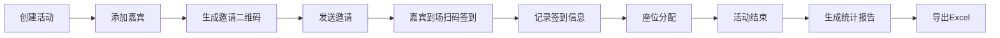

## 1. 产品概述

嘉宾邀请与接待管理工具是面向小型活动公司的一站式活动管理平台，解决活动策划、嘉宾邀请、签到接待、座位分配、数据统计等全流程管理问题。

- **核心目标**：提升活动组织效率，实现嘉宾管理数字化，提供精准的签到数据与分析
- **目标用户**：活动策划人员、现场接待人员、活动主办方管理人员
- **产品价值**：简化活动筹备流程，提升嘉宾体验，提供数据化活动效果评估

## 2. 核心功能

### 2.1 用户角色

| 角色 | 登录方式 | 核心权限 |
|------|----------|----------|
| 活动管理员 | 账号密码登录 | 活动创建与管理、嘉宾邀请、座位分配、数据统计、导出报告 |
| 现场接待员 | 账号密码登录 | 扫码签到、嘉宾信息查询、签到状态管理 |

### 2.2 功能模块

1. **活动管理**：活动列表、创建活动、编辑活动、活动详情
2. **嘉宾管理**：嘉宾列表、添加嘉宾、批量导入、嘉宾详情、邀请二维码
3. **签到管理**：扫码签到、手动签到、签到记录、签到状态查询
4. **座位管理**：座位区域配置、嘉宾座位分配、座位图预览
5. **统计报告**：签到统计、区域分布、实时数据、报告导出
6. **分论坛管理**：分论坛/分场地创建、嘉宾分组、日程分配

### 2.3 页面详情

| 页面名称 | 模块名称 | 功能描述 |
|---------|----------|----------|
| 登录页 | 登录表单 | 账号密码登录、表单验证 |
| 活动列表页 | 活动卡片列表 | 活动概览、搜索筛选、创建活动入口 |
| 活动详情页 | 活动信息 + 标签页 | 基本信息、嘉宾管理、签到统计、座位安排、分论坛 |
| 嘉宾管理页 | 嘉宾列表 + 操作栏 | 嘉宾列表、搜索筛选、添加/编辑/删除、批量操作 |
| 嘉宾详情页 | 嘉宾信息 + 二维码 | 基本信息、签到状态、邀请二维码、座位信息 |
| 签到页 | 扫码签到界面 | 摄像头扫码、手动输入、签到结果反馈 |
| 座位管理页 | 座位区域 + 分配操作 | 区域配置、嘉宾分配、拖拽分配 |
| 统计报告页 | 数据看板 + 图表 | 签到率、实到人数、区域分布、分论坛统计 |
| 分论坛管理页 | 分论坛列表 + 日程 | 分论坛创建、日程安排、嘉宾分组 |

## 3. 核心流程

### 3.1 活动创建与嘉宾邀请流程

活动管理员创建活动 → 填写活动基本信息 → 添加嘉宾信息 → 系统生成专属邀请二维码 → 发送邀请（邮件/短信）→ 嘉宾收到邀请

### 3.2 签到流程

现场接待员打开签到页 → 扫描嘉宾二维码 → 系统验证嘉宾身份 → 记录签到时间 → 显示签到成功/失败结果

### 3.3 座位分配流程

管理员配置座位区域 → 选择嘉宾 → 分配座位区域 → 保存分配结果 → 嘉宾可查看座位信息

### 3.4 统计报告生成流程

活动结束 → 系统自动汇总签到数据 → 生成统计报告（实到人数、签到率、各区域人数）→ 支持导出Excel

### 3.5 流程图

## 4. 用户界面设计

### 4.1 设计风格

- **主色调**：深靛蓝色（#1e3a5f）作为主色，传达专业、稳重的活动管理氛围
- **辅助色**：金色（#d4af37）作为点缀色，体现活动的品质感与仪式感
- **中性色**：以暖灰色系为主，营造舒适专业的视觉体验
- **按钮风格**：圆角设计，带有轻微阴影，hover时有微交互效果
- **字体**：标题使用 Noto Serif SC 展示高级感，正文使用 Inter 保证可读性
- **布局风格**：卡片式布局，层次分明，大量留白提升品质感
- **图标风格**：线性图标，统一2px描边，与整体简约专业风格一致

### 4.2 页面设计概览

| 页面名称 | 模块名称 | UI元素 |
|---------|----------|--------|
| 登录页 | 登录表单 | 深色背景 + 金色点缀、居中卡片布局、精致输入框、渐变按钮 |
| 活动列表页 | 活动卡片 | 网格布局卡片、活动封面图、状态标签、快捷操作按钮 |
| 活动详情页 | 信息看板 | 顶部活动横幅、标签页导航、数据统计卡片、内容区域 |
| 嘉宾管理页 | 数据表格 | 搜索栏、筛选器、操作按钮组、表格列表、分页控件 |
| 签到页 | 扫码界面 | 大尺寸扫码区域、扫描动画、嘉宾信息卡片、状态反馈 |
| 统计报告页 | 数据可视化 | 数字卡片、柱状图、饼图、趋势线、导出按钮 |
| 座位管理页 | 座位分布图 | 区域色块、嘉宾标签、拖拽交互、侧边栏分配面板 |

### 4.3 响应式设计

- **桌面优先**：以1920px宽度为主要设计基准，优化大屏数据展示
- **平板适配**：1024px~1280px，调整侧边栏宽度和卡片数量
- **移动端**：375px~768px，简化导航，优化表格展示，突出核心操作

### 4.4 动效设计

- 页面切换采用淡入淡出 + 轻微位移效果
- 卡片hover时有上浮和阴影加深效果
- 扫码界面有扫描线动画效果
- 数据统计数字有计数动画
- 按钮点击有按压反馈
