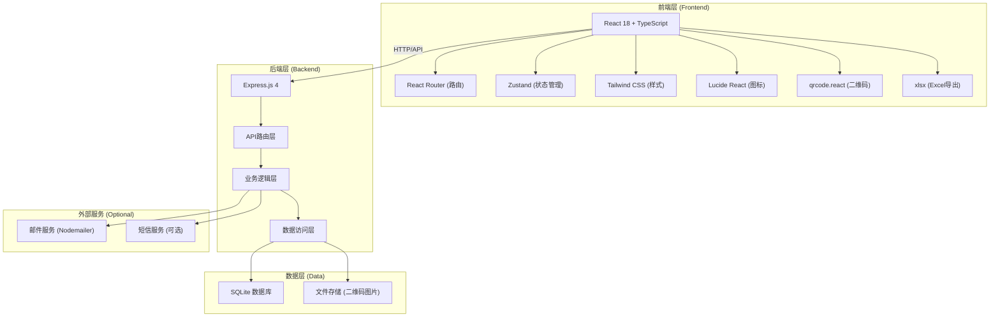
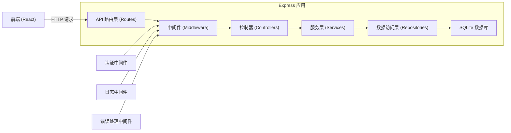
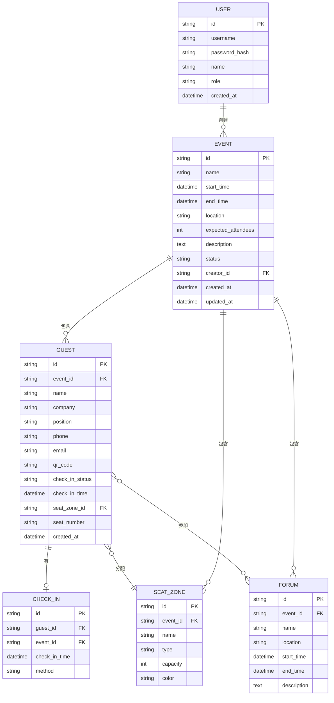

## 1. 架构设计



## 2. 技术描述

- **前端技术栈**: React 18 + TypeScript + Vite + Tailwind CSS 3 + Zustand + React Router v6
- **后端技术栈**: Express.js 4 + TypeScript
- **数据库**: SQLite (轻量级，适合小型活动公司使用)
- **初始化工具**: vite-init (react-express-ts 模板)
- **二维码生成**: qrcode.react (前端) / qrcode (后端)
- **Excel导出**: xlsx (SheetJS)
- **图标库**: lucide-react
- **UI组件**: 自定义组件 (基于 Tailwind CSS)

## 3. 路由定义

### 前端路由

| 路由路径 | 页面名称 | 说明 |
|---------|---------|------|
| /login | 登录页 | 用户登录入口 |
| /events | 活动列表页 | 展示所有活动，支持搜索筛选 |
| /events/:id | 活动详情页 | 活动基本信息与标签页导航 |
| /events/:id/guests | 嘉宾管理页 | 嘉宾列表、添加、编辑、删除 |
| /events/:id/guests/:guestId | 嘉宾详情页 | 嘉宾信息与邀请二维码 |
| /events/:id/checkin | 签到页 | 扫码签到、手动签到 |
| /events/:id/seats | 座位管理页 | 座位区域配置与分配 |
| /events/:id/reports | 统计报告页 | 签到统计与数据可视化 |
| /events/:id/forums | 分论坛管理页 | 分论坛与日程管理 |

### 后端API路由

| 方法 | 路径 | 说明 |
|-----|------|------|
| POST | /api/auth/login | 用户登录 |
| GET | /api/events | 获取活动列表 |
| GET | /api/events/:id | 获取活动详情 |
| POST | /api/events | 创建活动 |
| PUT | /api/events/:id | 更新活动 |
| DELETE | /api/events/:id | 删除活动 |
| GET | /api/events/:id/guests | 获取嘉宾列表 |
| GET | /api/events/:id/guests/:guestId | 获取嘉宾详情 |
| POST | /api/events/:id/guests | 添加嘉宾 |
| PUT | /api/events/:id/guests/:guestId | 更新嘉宾信息 |
| DELETE | /api/events/:id/guests/:guestId | 删除嘉宾 |
| POST | /api/events/:id/checkin | 嘉宾签到 |
| GET | /api/events/:id/checkins | 获取签到记录 |
| GET | /api/events/:id/qrcode/:guestId | 生成嘉宾二维码 |
| GET | /api/events/:id/seats | 获取座位配置 |
| POST | /api/events/:id/seats/zones | 创建座位区域 |
| PUT | /api/events/:id/guests/:guestId/seat | 分配嘉宾座位 |
| GET | /api/events/:id/reports | 获取统计报告 |
| GET | /api/events/:id/export | 导出嘉宾名单Excel |
| GET | /api/events/:id/forums | 获取分论坛列表 |
| POST | /api/events/:id/forums | 创建分论坛 |
| PUT | /api/events/:id/forums/:forumId | 更新分论坛 |
| DELETE | /api/events/:id/forums/:forumId | 删除分论坛 |
| POST | /api/events/:id/forums/:forumId/guests | 分配嘉宾到分论坛 |

## 4. API 数据类型定义

```typescript
// 活动
interface Event {
  id: string;
  name: string;
  startTime: string;
  endTime: string;
  location: string;
  expectedAttendees: number;
  description?: string;
  status: 'upcoming' | 'ongoing' | 'ended';
  createdAt: string;
  updatedAt: string;
}

// 嘉宾
interface Guest {
  id: string;
  eventId: string;
  name: string;
  company: string;
  position: string;
  phone: string;
  email: string;
  qrCode: string;
  checkInStatus: 'pending' | 'checked_in';
  checkInTime?: string;
  seatZone?: 'vip' | 'media' | 'general';
  seatNumber?: string;
  forumIds: string[];
  createdAt: string;
}

// 签到记录
interface CheckInRecord {
  id: string;
  guestId: string;
  eventId: string;
  checkInTime: string;
  method: 'qrcode' | 'manual';
}

// 座位区域
interface SeatZone {
  id: string;
  eventId: string;
  name: string;
  type: 'vip' | 'media' | 'general' | 'custom';
  capacity: number;
  color: string;
}

// 分论坛
interface Forum {
  id: string;
  eventId: string;
  name: string;
  location: string;
  startTime: string;
  endTime: string;
  description?: string;
  guestIds: string[];
}

// 统计报告
interface ReportData {
  totalGuests: number;
  checkedInCount: number;
  checkInRate: number;
  zoneStats: {
    zone: string;
    total: number;
    checkedIn: number;
  }[];
  checkInTrend: {
    time: string;
    count: number;
  }[];
}

// 用户
interface User {
  id: string;
  username: string;
  role: 'admin' | 'receptionist';
  name: string;
}
```

## 5. 服务器架构图



## 6. 数据模型

### 6.1 数据模型ER图



### 6.2 数据库DDL

```sql
-- 用户表
CREATE TABLE users (
  id TEXT PRIMARY KEY,
  username TEXT UNIQUE NOT NULL,
  password_hash TEXT NOT NULL,
  name TEXT NOT NULL,
  role TEXT NOT NULL DEFAULT 'admin',
  created_at DATETIME DEFAULT CURRENT_TIMESTAMP
);

-- 活动表
CREATE TABLE events (
  id TEXT PRIMARY KEY,
  name TEXT NOT NULL,
  start_time DATETIME NOT NULL,
  end_time DATETIME NOT NULL,
  location TEXT NOT NULL,
  expected_attendees INTEGER NOT NULL,
  description TEXT,
  status TEXT NOT NULL DEFAULT 'upcoming',
  creator_id TEXT NOT NULL,
  created_at DATETIME DEFAULT CURRENT_TIMESTAMP,
  updated_at DATETIME DEFAULT CURRENT_TIMESTAMP,
  FOREIGN KEY (creator_id) REFERENCES users(id)
);

-- 嘉宾表
CREATE TABLE guests (
  id TEXT PRIMARY KEY,
  event_id TEXT NOT NULL,
  name TEXT NOT NULL,
  company TEXT,
  position TEXT,
  phone TEXT,
  email TEXT,
  qr_code TEXT NOT NULL,
  check_in_status TEXT NOT NULL DEFAULT 'pending',
  check_in_time DATETIME,
  seat_zone_id TEXT,
  seat_number TEXT,
  created_at DATETIME DEFAULT CURRENT_TIMESTAMP,
  FOREIGN KEY (event_id) REFERENCES events(id) ON DELETE CASCADE,
  FOREIGN KEY (seat_zone_id) REFERENCES seat_zones(id)
);

-- 签到记录表
CREATE TABLE check_ins (
  id TEXT PRIMARY KEY,
  guest_id TEXT NOT NULL,
  event_id TEXT NOT NULL,
  check_in_time DATETIME DEFAULT CURRENT_TIMESTAMP,
  method TEXT NOT NULL DEFAULT 'qrcode',
  FOREIGN KEY (guest_id) REFERENCES guests(id) ON DELETE CASCADE,
  FOREIGN KEY (event_id) REFERENCES events(id) ON DELETE CASCADE
);

-- 座位区域表
CREATE TABLE seat_zones (
  id TEXT PRIMARY KEY,
  event_id TEXT NOT NULL,
  name TEXT NOT NULL,
  type TEXT NOT NULL,
  capacity INTEGER NOT NULL,
  color TEXT,
  FOREIGN KEY (event_id) REFERENCES events(id) ON DELETE CASCADE
);

-- 分论坛表
CREATE TABLE forums (
  id TEXT PRIMARY KEY,
  event_id TEXT NOT NULL,
  name TEXT NOT NULL,
  location TEXT,
  start_time DATETIME,
  end_time DATETIME,
  description TEXT,
  FOREIGN KEY (event_id) REFERENCES events(id) ON DELETE CASCADE
);

-- 嘉宾-分论坛关联表
CREATE TABLE forum_guests (
  id TEXT PRIMARY KEY,
  forum_id TEXT NOT NULL,
  guest_id TEXT NOT NULL,
  FOREIGN KEY (forum_id) REFERENCES forums(id) ON DELETE CASCADE,
  FOREIGN KEY (guest_id) REFERENCES guests(id) ON DELETE CASCADE,
  UNIQUE(forum_id, guest_id)
);

-- 索引
CREATE INDEX idx_guests_event_id ON guests(event_id);
CREATE INDEX idx_guests_qr_code ON guests(qr_code);
CREATE INDEX idx_check_ins_event_id ON check_ins(event_id);
CREATE INDEX idx_check_ins_guest_id ON check_ins(guest_id);
CREATE INDEX idx_seat_zones_event_id ON seat_zones(event_id);
CREATE INDEX idx_forums_event_id ON forums(event_id);

-- 初始管理员数据
INSERT INTO users (id, username, password_hash, name, role)
VALUES ('admin-001', 'admin', 'admin123', '系统管理员', 'admin');
```
